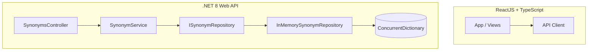

# SynonymLink

SynonymLink is a production-ready, high-performance web application designed to search, manage, and visualize synonym pairs with bi-directional and transitive relationships.

The application features a clean architecture **.NET 8 Web API** backend and a modern **ReactJS (TypeScript + Vite)** frontend.

- **Frontend Application:** [https://synonym-link.vercel.app/](https://synonym-link.vercel.app/)
- **Production API Service:** [https://synonym-link-api.onrender.com](https://synonym-link-api.onrender.com)

---

## Key Features

1. **Manual Entry:** Add bi-directional synonym pairs where if `A` is a synonym of `B`, `B` is automatically mapped as a synonym of `A`.
2. **Transitive Relations:** Automatically resolves multi-level connections so that if `A = B` and `B = C`, searching for any word retrieves the entire transitive set.
3. **Live Sentence Analyzer:** A dynamic text input that tokenizes sentences on the fly, overlays matching synonyms above recognized words, and includes clickable presets for instant testing.
4. **1,000+ Word Seeding:** Populate the database with over 1,000 unique words by triggering a recursive seeding process against the external Datamuse API.
5. **Interactive Network Graph:** A fullscreen D3 force-directed canvas graph that supports dragging, zooming, and grouping synonyms dynamically by color component.
6. **Harmonious Theme:** A responsive design with premium glassmorphic styling, smooth CSS transitions, and a toggle between light and dark mode.
7. **Session Tracking:** Generates a unique guest session UUID on the frontend and isolates synonym data per user via custom `X-User-Id` headers.
8. **Cascading Word Deletion:** Allows deleting individual words and recursively pruning their first-degree and second-degree connections with a confirmation preview.
9. **Automated Quality Hooks:** Enforces code style checks during commit and runs test suites before pushes.
10. **Pull Request Quality Gates:** Automatically validates frontend builds, styles, and backend tests on every pull request.
11. **Automated Dependency PRs:** Checks for outdated libraries weekly to open pull requests with upgrades automatically.
12. **Word Renaming:** Enables changing the text of any word while preserving and merging all of its synonym connections automatically.
13. **Synonym Connection Deletion:** Allows severing the direct synonym relationship between two words, with automatic cleanup of isolated words.

---

## Architectural Decisions



### Backend Design
- **Clean Architecture Folders:** The codebase is structured logically into `Api` (Controllers), `Services` (Service/IService), `Models`, and `Repositories` (Repository/IRepository).
- **Repository Pattern:** To facilitate switching to SQL databases or other persistent storage layers in the future, the storage interface is defined via `ISynonymRepository` and registered as a Singleton.
- **Thread-Safety:** `InMemorySynonymRepository` uses a thread-safe `ConcurrentDictionary<string, ConcurrentDictionary<string, byte>>` acting as a synchronized adjacency list to store undirected graph edges.
- **Decoupled Business Logic:** Transitive closure calculations (Breadth-First Search) and connected components grouping (for graph colors) are handled in the `SynonymService` layer, completely isolated from storage concerns.

---

## Getting Started (Local Setup)

### Prerequisites
- [.NET 8 SDK](https://dotnet.microsoft.com/download/dotnet/8.0)
- [Node.js (v18+)](https://nodejs.org/)
- [Yarn Package Manager](https://yarnpkg.com/)

---

### Running the Backend

1. Navigate to the backend folder:
   ```bash
   cd backend
   ```
2. Restore dependencies:
   ```bash
   dotnet restore
   ```
3. Run the Web API:
   ```bash
   dotnet run
   ```
   The backend will start and list its endpoints:
   - Swagger Documentation: `http://localhost:5148/swagger`
   - Active Endpoint: `http://localhost:5148/api`

4. Debugging in Visual Studio:
   - Simply open [SynonymsApp.sln](file:///c:/Users/USER/Desktop/Edin/Synonyms/backend/SynonymsApp.sln) inside Visual Studio and run the application.

---

### Running the Frontend

1. Navigate to the frontend folder:
   ```bash
   cd frontend
   ```
2. Install npm packages:
   ```bash
   yarn
   ```
3. Start the Vite development server:
   ```bash
   yarn dev
   ```
4. Verify/build options:
   - Check linting errors: `yarn lint`
   - Build for production: `yarn build`

Open your browser at `http://localhost:5173` to explore the app.

---

## API Endpoints Reference

| Method | Endpoint | Description |
| :--- | :--- | :--- |
| `POST` | `/api/synonyms` | Add a synonym pair. JSON body: `{ "word1": "...", "word2": "..." }` |
| `GET` | `/api/synonyms/{word}` | Look up all transitive synonyms for a single word (accepts optional query parameter `directOnly`). |
| `POST` | `/api/synonyms/analyze` | Split a sentence and lookup synonyms for each word. JSON body: `{ "sentence": "..." }` |
| `GET` | `/api/synonyms/graph` | Retrieve the complete graph structured with color groups for network rendering. |
| `POST` | `/api/synonyms/seed-external` | Seed 1,000+ words from the Datamuse API. |
| `GET` | `/api/synonyms/{word}/delete-preview` | Get a preview of cascading connection deletions before performing a delete. |
| `PUT` | `/api/synonyms/{word}` | Rename a word. JSON body: `{ "newWord": "..." }` |
| `DELETE` | `/api/synonyms/{word}` | Delete a word and its connections (optional query parameter `mode` defaults to "cascade"). |
| `DELETE` | `/api/synonyms/relationship` | Delete a direct relationship between two synonyms. Query parameters: `word1` and `word2`. |

---

## Deployment Guide

### Backend deployment on Render.com
1. Create a Web Service on Render pointing to your GitHub repository.
2. Select **Docker** as the Environment.
3. In Advanced settings, set the Build Context to `backend`.
4. Render will read the [Dockerfile](file:///c:/Users/USER/Desktop/Edin/Synonyms/backend/Dockerfile), compile, test, and expose port `8080` (mapped to `80`) automatically.

### Frontend deployment on Vercel
1. Link your repository in Vercel.
2. Set the framework preset to **Vite**.
3. Set the Root Directory to `frontend`.
4. In Environment Variables, set:
   `VITE_API_URL=https://<your-render-backend-url>/api`
5. Click **Deploy**. Vercel will build and serve your React app globally.

---

## Git Hooks, CI Quality Gates & Automations

### Git Hooks (Husky)
To enforce code quality and verify that no broken tests are committed or pushed:
- **Pre-commit Hook**: Runs ESLint checks on the frontend to ensure high code quality.
- **Pre-push Hook**: Executes both frontend and backend tests, preventing pushing if any test fails.

To set up Git hooks locally, run:
```bash
yarn install
```

### CI Quality Gates (GitHub Actions)
Every pull request targeting the `main` or `master` branch triggers the [CI Quality Gates workflow](.github/workflows/ci.yml):
- **Frontend Job**: Validates the codebase using linter (`yarn lint`), builds the project (`yarn build`), and runs tests (`yarn test`).
- **Backend Job**: Sets up the .NET environment, restores NuGet packages, builds the backend, and runs backend tests (`dotnet test`).

### Automated Dependency Updates
The [Automated Dependency Updates workflow](.github/workflows/dependency-updates.yml) runs automatically every Sunday (or can be triggered manually) to check for newer package versions:
- **Frontend**: Scans and upgrades package dependencies via `npm-check-updates` and regenerates `yarn.lock`.
- **Backend**: Scans and upgrades NuGet package dependencies to their latest stable version via `dotnet-outdated`.
- If updates are available, a new branch is created and a Pull Request is opened automatically to merge the changes.
