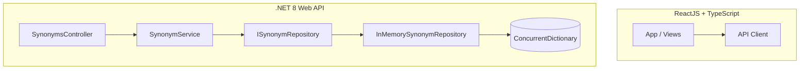

# SynonymLink

SynonymLink is a production-ready, high-performance web application designed to search, manage, and visualize synonym pairs with bi-directional and transitive relationships.

The application features a clean architecture **.NET 8 Web API** backend and a modern **ReactJS (TypeScript + Vite)** frontend.

---

## Key Features

1. **Manual Entry:** Add bi-directional synonym pairs (`A` is a synonym of `B` implies `B` is a synonym of `A`).
2. **Transitive Relations:** Resolves multi-level connections. If `A = B` and `B = C`, searching for `A` returns `{B, C}` and searching for `C` returns `{A, B}` automatically.
3. **Live Sentence Analyzer:** A text field that dynamically tokenizes your inputs and overlays matching synonyms directly above each recognized word. Includes 5 clickable presets for instant testing.
4. **1,000+ Word Seeding:** Trigger seeding to query the **Datamuse API** recursively across 30+ core English words, populating the repository with over 1,000 unique words and relations.
5. **Interactive Network Graph:** A fullscreen, physics-simulated D3 force-directed HTML5 Canvas graph. It groups and colors nodes by their connected component (synonym group), supports panning, zooming, and node dragging, and allows selecting words to highlight their local transitive network.
6. **Harmonious Theme:** Light and Dark mode toggle with premium glassmorphic styling, smooth CSS transitions, and fully responsive layouts.

---

## Architectural Decisions



### Backend Design
- **Clean Architecture Folders:** The codebase is structured logically into `Api` (Controllers), `Services` (Service/IService), `Models`, and `Repositories` (Repository/IRepository).
- **Repository Pattern:** To facilitate switching to SQL databases or other persistent storage layers in the future, the storage interface is defined via `ISynonymRepository` and registered as a Singleton.
- **Thread-Safety:** `InMemorySynonymRepository` uses a thread-safe `ConcurrentDictionary<string, ConcurrentDictionary<string, byte>>` acting as a synchronized adjacency list to store undirected graph edges.
- **Decoupled Business Logic:** Transitive closure calculations (Breadth-First Search) and connected components grouping (for graph colors) are handled in the `SynonymService` layer, completely isolated from storage concerns.

---

## Getting Started (Local Setup)

### Prerequisites
- [.NET 8 SDK](https://dotnet.microsoft.com/download/dotnet/8.0)
- [Node.js (v18+)](https://nodejs.org/)
- [Yarn Package Manager](https://yarnpkg.com/)

---

### Running the Backend

1. Navigate to the backend folder:
   ```bash
   cd backend
   ```
2. Restore dependencies:
   ```bash
   dotnet restore
   ```
3. Run the Web API:
   ```bash
   dotnet run
   ```
   The backend will start and list its endpoints:
   - Swagger Documentation: `http://localhost:5148/swagger`
   - Active Endpoint: `http://localhost:5148/api`

4. Debugging in Visual Studio:
   - Simply open [SynonymsApp.sln](file:///c:/Users/USER/Desktop/Edin/Synonyms/backend/SynonymsApp.sln) inside Visual Studio and run the application.

---

### Running the Frontend

1. Navigate to the frontend folder:
   ```bash
   cd frontend
   ```
2. Install npm packages:
   ```bash
   yarn
   ```
3. Start the Vite development server:
   ```bash
   yarn dev
   ```
4. Verify/build options:
   - Check linting errors: `yarn lint`
   - Build for production: `yarn build`

Open your browser at `http://localhost:5173` to explore the app.

---

## API Endpoints Reference

| Method | Endpoint | Description |
| :--- | :--- | :--- |
| `POST` | `/api/synonyms` | Add a synonym pair. JSON body: `{ "word1": "...", "word2": "..." }` |
| `GET` | `/api/synonyms/{word}` | Look up all transitive synonyms for a single word. |
| `POST` | `/api/synonyms/analyze` | Split a sentence and lookup synonyms for each word. JSON body: `{ "sentence": "..." }` |
| `GET` | `/api/synonyms/graph` | Retrieve the complete graph structured with color groups for network rendering. |
| `POST` | `/api/synonyms/seed-external` | Seed 1,000+ words from the Datamuse API. |

---

## Deployment Guide

### Backend deployment on Render.com
1. Create a Web Service on Render pointing to your GitHub repository.
2. Select **Docker** as the Environment.
3. In Advanced settings, set the Build Context to `backend`.
4. Render will read the [Dockerfile](file:///c:/Users/USER/Desktop/Edin/Synonyms/backend/Dockerfile), compile, test, and expose port `8080` (mapped to `80`) automatically.

### Frontend deployment on Vercel
1. Link your repository in Vercel.
2. Set the framework preset to **Vite**.
3. Set the Root Directory to `frontend`.
4. In Environment Variables, set:
   `VITE_API_URL=https://<your-render-backend-url>/api`
5. Click **Deploy**. Vercel will build and serve your React app globally.
# SynonymLink
